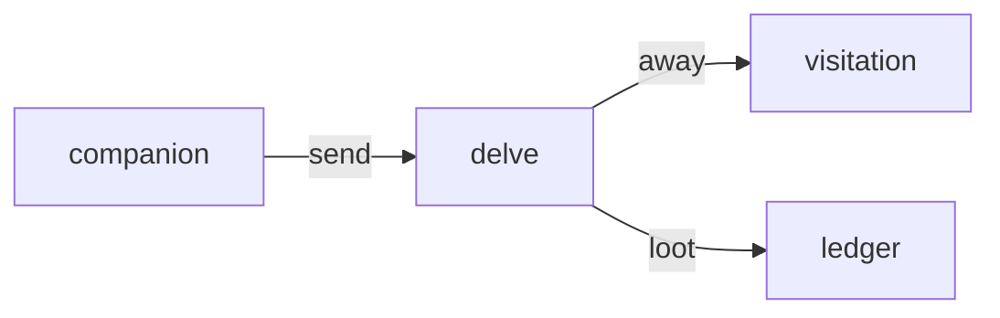

# Delve

**Dungeon Crawl Pets** — Send pets on automated timed expeditions for loot while they still live on the desktop.

Part of [ComputerPets](https://github.com/RicheyWorks/computerpets). Map: [computerpets-ecosystem](https://github.com/RicheyWorks/computerpets-ecosystem).

| | |
| --- | --- |
| Status | Design scaffold — loop and engine frozen |
| License | MIT |
| Tokens | Minigames never mint or burn. Tired overlay, not a dead lineage. |
| First pet | [Meet Rui first](https://github.com/RicheyWorks/computerpets/blob/main/docs/START-HERE.md). This game is optional. |

## The loop

You cannot watch Rui 24h. Delve is the off-duty dungeon: a pet leaves the overlay for N hours, returns with loot or a scratch. Overlay shows 'away on delve'.

## Who plays

Players who cannot watch the overlay 24h.

## What it is not

Not permadeath. Away-on-delve is a presence state.

## Genre and engine

- Genre: **Idle / text RPG**
- Engine: **Spring Boot**
- Stack: Java 21 · Spring Boot 3.3 · scheduler expeditions · PostgreSQL loot · Companion UI later
- Default surface: `8095`

## Architecture



## How you play

1. POST /v1/delve — pick pet + dungeon + duration.
2. Pet is not on the desktop until return.
3. Loot table keyed by species biome (panda ≠ reef).
4. Scratch = medicine care on return.

## First slice

Build this and stop.

**POST delve 1h for Rui, overlay shows away, return with loot or a scratch.**

You know it works when: Crash mid-job: durable return. Double-send 409. Death of a line is not a loot outcome.

## Environment

JDK 21, `DATABASE_URL`

## Failure doctrine

Server crash mid-delve → job is durable, pet returns on restart. Double-send → 409. Death of a line is not a loot outcome.

Canon rules that never yield:

- 210 living kinds. No illegal hybrids.
- Overlay pets can get tired, sick, or hide. Tokens are not burned by a minigame.
- Desktop walk stays the main quest. Closing Delve must leave Rui walking.

## Neighbors

- computerpets-visitation (away state)
- computerpets-ledger
- computerpets-quests
- computerpets-companion
- computerpets-forensics (stuck jobs)

## Layout

```
computerpets-delve/
  README.md
  LICENSE
  docs/DESIGN.md
  src/                implementation lands here
```

## Run (Windows)

```powershell
mvn -q -DskipTests package; java -jar target/delve-1.0.0-SNAPSHOT.jar
```

Meet Rui first via the [flagship start-here](https://github.com/RicheyWorks/computerpets/blob/main/docs/START-HERE.md). This game is optional.

## Links

- Flagship: [RicheyWorks/computerpets](https://github.com/RicheyWorks/computerpets)
- This repo: [RicheyWorks/computerpets-delve](https://github.com/RicheyWorks/computerpets-delve)
- Map: [RicheyWorks/computerpets-ecosystem](https://github.com/RicheyWorks/computerpets-ecosystem)
- Design file: [docs/DESIGN.md](docs/DESIGN.md)

## License

MIT. See [LICENSE](LICENSE).

---

*Two hundred ten living kinds. Keep them so a line does not go quiet.*
