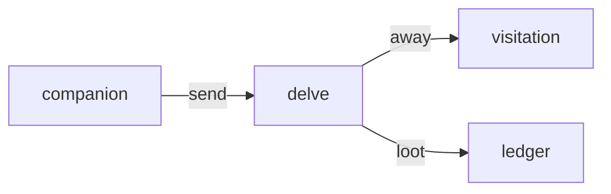

# Delve

**Send your pet on an off-duty expedition.**

A planned idle expedition service where a pet leaves the desktop for a timed trip and returns with loot or a care need.

**Stage: design scaffold.** This checkout contains a design document and a source placeholder. The experience below is planned; there is no runnable app or integrated service yet.

[Status](#status) · [Planned experience](#planned-experience) · [Contributor quickstart](#contributor-quickstart) · [Game design](docs/DESIGN.md) · [Ecosystem map](https://github.com/RicheyWorks/computerpets-ecosystem)

## Status

| Available today | What you can inspect |
| --- | --- |
| [Game design](docs/DESIGN.md) | Intended behavior, boundaries, and planned dependencies. |
| [Source placeholder](src/main/java/com/enterprisepet/delve/package-info.java) | Java package declaration; no Maven/Gradle build or application is checked in. |
| [MIT license](LICENSE) | Licensing terms for the repository. |

Gameplay, endpoints, integration arrows, and failure handling on this page describe implementation targets. No build/test harness, CI workflow, or product screenshots are included in this scaffold.

## Planned experience

- POST /v1/delve — pick pet + dungeon + duration.
- Pet is not on the desktop until return.
- Loot table keyed by species biome (panda ≠ reef).
- Scratch = medicine care on return.

### Planned technology

- Genre: **Idle / text RPG**
- Engine: **Spring Boot**
- Stack: Java 21 · Spring Boot 3.3 · scheduler expeditions · PostgreSQL loot · Companion UI later
- Default surface: `8095`

### Planned connections

These arrows show intended dependencies, rather than working integrations.



## Contributor quickstart

With access to this private repository, Git and PowerShell are enough to review the scaffold:

```powershell
git clone https://github.com/RicheyWorks/computerpets-delve.git
Set-Location computerpets-delve
Get-Content docs/DESIGN.md
Get-Content src/main/java/com/enterprisepet/delve/package-info.java
```

Read [Game design](docs/DESIGN.md) before choosing implementation details. The commands above inspect the checked-in files; app installation, editor launch, and server startup become possible after a buildable project and entry point are added.

### First implementation target

**POST delve 1h for Rui, overlay shows away, return with loot or a scratch.**

You know it works when: Crash mid-job: durable return. Double-send 409. Death of a line is not a loot outcome.

Treat this as an acceptance target for a future implementation. Start with the documented slice, add the required project setup and focused tests, and update these instructions with commands that work from a fresh clone.

## Design boundaries

1. Minigames cannot mint or burn NFTs by themselves (Minter is the write path).
2. Stats come from lived overlay care + Dojo caps, not cash shop.
3. Species kits stay inside Lore. Illegal hybrids never spawn.
4. Fail soft: the desktop overlay process is not this process.

**Required failure behavior:**

Server crash mid-delve → job is durable, pet returns on restart. Double-send → 409. Death of a line is not a loot outcome.

## Ecosystem

- [computerpets-visitation](https://github.com/RicheyWorks/computerpets-visitation) (away state)
- [computerpets-ledger](https://github.com/RicheyWorks/computerpets-ledger)
- [computerpets-quests](https://github.com/RicheyWorks/computerpets-quests)
- [computerpets-companion](https://github.com/RicheyWorks/computerpets-companion)
- [computerpets-forensics](https://github.com/RicheyWorks/computerpets-forensics) (stuck jobs)

Start with the [ComputerPets flagship](https://github.com/RicheyWorks/computerpets) for the desktop pet. This repository describes an optional extension; the [ecosystem map](https://github.com/RicheyWorks/computerpets-ecosystem) explains the broader plan.

## License

MIT. See [LICENSE](LICENSE).
